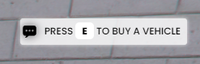
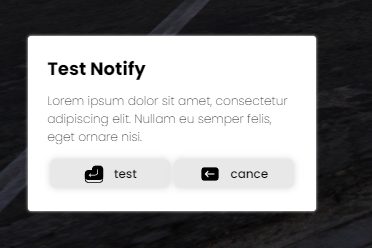

import { Steps } from 'nextra-theme-docs';
import { Callout } from 'nextra/components';
import { Tabs, Tab } from 'nextra-theme-docs';

## Functions
<Callout type="info">
Here you will find a list of **all available functions** to integrate into your own scripts.
</Callout>

<Steps>
### Show Notification

<Callout type="info">
These notifications are displayed in the right corner, they only show information and cannot be interacted with.
</Callout>


```lua {1} showLineNumbers filename="example.lua"
exports['ice_hud']:Notify(Text, 5000)
```
#### Params
- Notification Text (The text that will be displayed in the notification)
- Notification Time (The time the notification will be open expressed in milliseconds)

#### Example

Here we see the difference between an QBCore and an ICE notification, the most notable difference is the appearance of one more parameter in the function, which in this case is the duration so that you can modify it to your liking.

<Tabs items={["QBCore Notification", "Ice Notification"]}>
    <Tab>
        ```lua {1} showLineNumbers filename="example.lua"
        QBCore.Functions.Notify("My QBCore testing notification")
        ```
    </Tab>
    
    <Tab>
        ```lua {1} showLineNumbers filename="example.lua"
        exports['ice_hud']:Notify("My Ice testing notification", 5000)
        ```
    </Tab>
</Tabs>


<Callout type="warning">
The notification time is expressed in milliseconds, so 5 seconds equals 5000 milliseconds. Otherwise the notification will not work.
</Callout>


### Help Notification

<Callout type="info">
These notifications are displayed at the top right, and give information to interact with certain things.
</Callout>



 ```lua {1} showLineNumbers filename="example.lua"
exports['ice_hud']:HelpNotify(Text)
```

#### Params
- Notification Text (The text that will be displayed in the notification)

#### Example

There is no difference between the QBCore and ICE function, the parameters are the same, you only need to change the name of the function.


<Tabs items={["QBCore Help Notification", "Ice Help Notification"]}>
    <Tab>
        ```lua {1} showLineNumbers filename="example.lua"
        QBCore.Functions.DrawText3D(154.54, -200.4, 35, "My QBCore help notification example")
        ```
    </Tab>
    
    <Tab>
        ```lua {1} showLineNumbers filename="example.lua"
        exports['ice_hud']:HelpNotify("My Ice help notification example")
        ```
    </Tab>
</Tabs>

### Request Notification

<Callout type="info">
This notification allows the user to receive a request in which he can accept or reject it.
</Callout>



 ```lua {1} showLineNumbers filename="example.lua"
local dialog = exports['ice_hud']:RequestNotify({
        title = "My Title",
        description = "My description",
        btnAccept = "Accept",
        btnCancel = "Decline"
})
-- dialog return a bool value
```

#### Params (values must be inside a JSON):

- title (The title of the request notify)
- description (The text that will be placed above the title that contain all info related to the notify)
- btnAccept (The text that will be inside the accept button)
- btnCancel (The text that will be inside the cancel button)

#### Return
- A bool value that is the option that the user has selected.

<Tabs items={["Example 1", "Example 2"]}>
    <Tab>
        In this example a notification is shown when the player enters the command "reqnotify", in any case a notification will appear notifying the player of the action performed.
    
        ```lua {1-14} showLineNumbers filename="example.lua"
        RegisterCommand("reqnotify", function()
            local dialog = exports['ice_hud']:RequestNotify({
                title = "Test Notify",
                Description = "Lorem ipsum dolor sit amet, consectetur adipiscing elit. Nullam eu semper felis, eget ornare nisi. ",
                btnAccept = "test",
                btnCancel = "cance"
            })
            
            if dialog == true then
                exports['ice_hud']:Notify("ACCEPTED!", 5000)
            else
                exports['ice_hud']:Notify("REJECTED!", 5000)
            end
        end)
        ```
    </Tab>
    
    <Tab>
        In this example a notification is displayed asking the player if he wants to buy an adder for $50,000, in case he refuses a notification will appear alerting him of the action.
        ```lua {1-21} showLineNumbers filename="example.lua"
        local dialog = exports['ice_hud']:RequestNotify({
            title = "Buy Vehicle",
            Description = "¿You want to buy a adder for 50.000$?",
            btnAccept = "Yes",
            btnCancel = "No"
        })
            
        if dialog == true then
                local coords = QBCore.Functions.GetCoords(PlayerPedId())
                QBCore.Functions.SpawnVehicle('adder', function(veh)
                    SetVehicleNumberPlateText(veh, 'TEST')
                    SetEntityHeading(veh, coords.w)
                    exports['LegacyFuel']:SetFuel(veh, 100.0)
                    TaskWarpPedIntoVehicle(PlayerPedId(), veh, -1)
                    TriggerEvent("vehiclekeys:client:SetOwner", QBCore.Functions.GetPlate(veh))
                    SetVehicleEngineOn(veh, true, true)
                end, coords, true)
                exports['ice_hud']:Notify("YOU HAVE BOUGHT AN ADDER!", 5000)
        else
                exports['ice_hud']:Notify("YOU HAVE DECLINED THE OFFERT!", 5000)
        end
        ```
    </Tab>
</Tabs>

</Steps>
