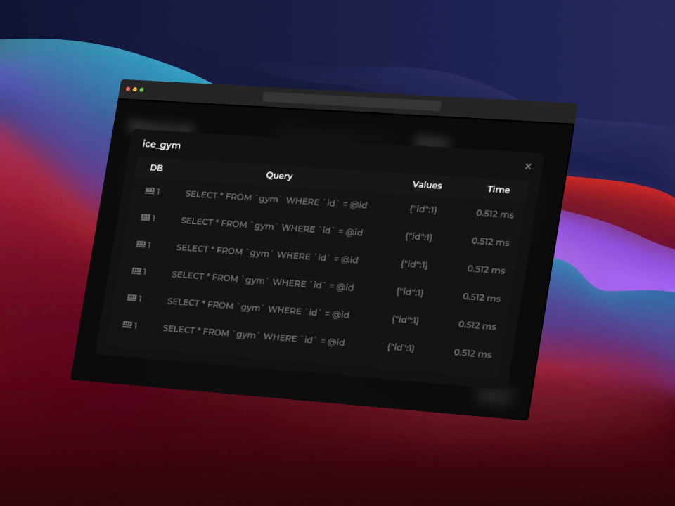

# Ic MySQL

import { Steps } from 'nextra-theme-docs';
import { Callout } from 'nextra/components';
import Resource from '@components/Resource';

An sophisticated encapsulation of the mysql2 and sequelize libraries, ingeniously designed to empower CFX scripts with seamless capabilities for accessing and manipulating data within relational databases.

### Why?
We created this database connection system because, even though there are good solutions out there, we wanted to bring something new to the table for the FiveM community. We've added some cool features that are missing in other systems, and we hope you find it useful!
### Known Issues
We're going to list some known issues here, so you don't have to worry about them. Or you don't have to report them, because we already know about them. If you find any other issues, please report them in our [Discord Server](https://discord.gg/3DhEgXAX2U). 
- First query after a restart is slow(because we wait to make the connection to the database)
- Thread hitch warning when starting the resource(don't worry, it's normal)
### Support
Right now we only give support in our [Discord Server](https://discord.gg/3DhEgXAX2U). Anyway you can open an issue in our [GitHub](https://github.com/IceClusters/icmysql/issues), if you ask in the forum we will try to answer you as soon as possible but to make sure to get an answer join our [Discord Server](https://discord.gg/3DhEgXAX2U).